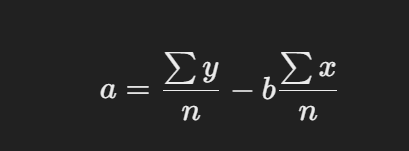
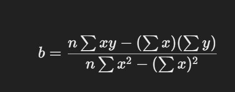
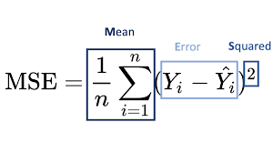
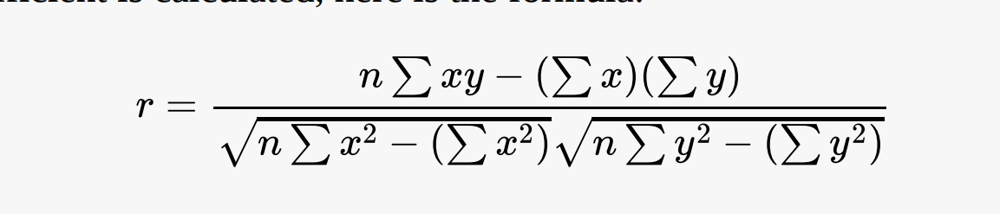
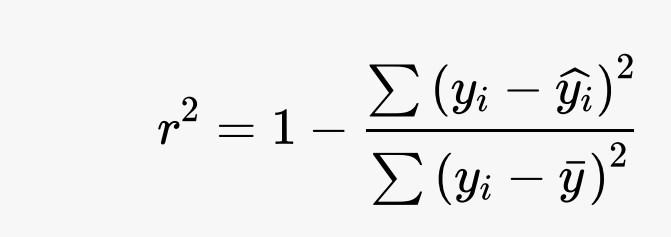
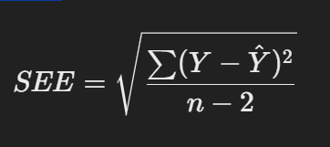

# Linear Regression

## Table of Contents
- [Introduction](#introduction)
- [Example Applications of Linear Regression](#example-applications-of-linear-regression)
- [Objective](#objective)
- [Key Terms](#key-terms)
  - [Centroid](#1-centroid)
  - [Observed Value](#2-observed-value)
  - [Residuals](#3-residuals)
  - [Error](#4-error)
  - [Sum of Squared Errors (SSE)](#5-sum-of-squared-errors-sse)
  - [Total Sum of Squares (SST)](#6-total-sum-of-squares-sst)
  - [Mean Squared Error (MSE)](#7-mean-squared-error-mse)
  - [Correlation](#Correlation)
  - [Coefficient of Determination](#Coefficient-of-Determination)
  

## Introduction
Linear regression is a branch of regression analysis that focuses on modeling the relationship between a dependent variable and one or more independent variables by fitting a linear equation to observed data. It assumes there is a linear relationship between the variables.

## Example Applications of Linear Regression
- Analyzing trends and sales estimates
- Salary forecasting
- Real estate prediction
- Arriving at ETAs in traffic

## Objective
The aim of linear regression is to find a line that best fits the data, called the **Least Squares Line**, which minimizes the sum of the squared residuals (SSE). The equation for the line is:

- *y = b_0 + b_1 * x + ε*

Where:
- **y** is the predicted value of **y**.
- **b_0** is the y-intercept of the line.
- **b_1** is the slope of the line.

## Key Terms
- In this explanation, we will use sample data for easy understanding. Given the following dataset:

| Independent (x) | Actual (y) |
|-----------------|------------|
| 1               | 4          |
| 2               | 2          |
| 3               | 5          |
| 4               | 7          |
| 5               | 3          |

### 1. Centroid
- Mean of the x-variable and mean of the y-variable.
- The best-fit line must always pass through this point.

- [ sum(x)]/5 = 1 + 2 + 3 + 4 + 5 = 15/5
- [ sum(y)]/5 = 4 + 2 + 5 + 7 + 3 = 21/5


- For the above data centroid is **(3, 4.2)**.

### 2. Observed Value
- It is calculated using the regression equation:

- 𝑦_hat = b_0 + b_1 * x + ε
```
Sum of 𝑥𝑦 = (1 * 4) + (2 * 2) + (3 * 5) + (4 * 7) + (5 * 3) = 4 + 4 + 15 + 28 + 15 = 66
Sum of 𝑥^2 = 1^2 + 2^2 + 3^2 + 4^2 + 5^2 = 1 + 4 + 9 + 16 + 25 = 55
Slope (𝑏_1) = (5 * 66 - 15 * 21) / (5 * 55 - 15^2) = (330 - 315) / (275 - 225) = 15 / 50 = 0.3
Y-intercept (𝑏_0) = (21 - 0.3 * 15) / 5 = (21 - 4.5) / 5 = 16.5 / 5 = 3.3
y_hat= 3.3 + 0.3 * x
```
- Y intercept

- slope

 
| Independent (x) | Actual (y) | Predicted (\( \hat{y} \)) |
|-----------------|------------|--------------------------|
| 1               | 4          | 3.3 + 0.3(1) = 3.6        |
| 2               | 2          | 3.3 + 0.3(2) = 3.9        |
| 3               | 5          | 3.3 + 0.3(3) = 4.2        |
| 4               | 7          | 3.3 + 0.3(4) = 4.5        |
| 5               | 3          | 3.3 + 0.3(5) = 4.8        |


### 3. Residuals
- Refer to the differences between the observed values of the dependent variable and the corresponding predicted values based on the linear regression model.
- ε = y - y_hat
- 

### 4. Error
- Differences between the observed values of the dependent variable and the true (actual) values.
- Same as residuals.

### 5. Sum of Squared Errors (SSE)
- Measure used to quantify the difference between the observed values of the target variable and the values predicted by the regression model.
- Calculated by summing the squared differences between each observed value and its corresponding predicted value.

```
SSE = Σ ε^2
SSE = (0.4)^2 + (-1.9)^2 + (0.8)^2 + (2.5)^2 + (-1.8)^2
SSE = 0.16 + 3.61 + 0.64 + 6.25 + 3.24
SSE = 13.9
```

### 6. Total Sum of Squares (SST)
- Represents the total variation in the dependent variable (or target variable) **y** from its mean.

```
y_bar = 21 / 5 = 4.2
SST = Σ (y_i - y_bar)^2
SST = (4 - 4.2)^2 + (2 - 4.2)^2 + (5 - 4.2)^2 + (7 - 4.2)^2 + (3 - 4.2)^2
SST = (-0.2)^2 + (-2.2)^2 + (0.8)^2 + (2.8)^2 + (-1.2)^2
SST = 0.04 + 4.84 + 0.64 + 7.84 + 1.44
SST = 14.8
```

### 7. Mean Squared Error (MSE)
- A common measure used to evaluate the performance of a regression model or predictor.
- Calculates the average of the squares of the errors, or differences, between actual and predicted values in a regression problem.
- A lower MSE indicates that the model's predictions are closer to the actual values, implying better performance.

- MSE = SSE / n = 13.9 / 5 = 2.78

- 

## Correlation
- measures the statistical relationship between two variables, indicating how changes in one variable are associated with changes in another. 
- Positive Correlation: Both variables increase or decrease together.
- Negative Correlation: One variable increases while the other decreases.
- Ranges from -1 to 1. 
- A correlation coefficient closer to 0 indicates there is no correlation.
- A correlation coefficient closer to 1 indicates a strong positive correlation,
meaning when one variable increases, the other proportionally increases. 
- If it is closer to –1 then it indicates a strong negative correlation, which means
as one variable increases the other proportionally decreases.
- 

Coefficient of Determination
- The coefficient of determination is the square of the Pearson correlation coefficient 𝑟.
- It represents the proportion of the variance in the dependent variable that is predictable from the independent variable.
- Essentially,indicates the strength of the relationship between the two variables.
- 


## Standard Error(Se)
- The standard error of the estimate (SEE) measures the accuracy of predictions made by a regression line.
- It gives an estimate of the standard deviation of the errors (residuals) in predicting the dependent variable.
- The formula for the standard error of the estimate is:
- 